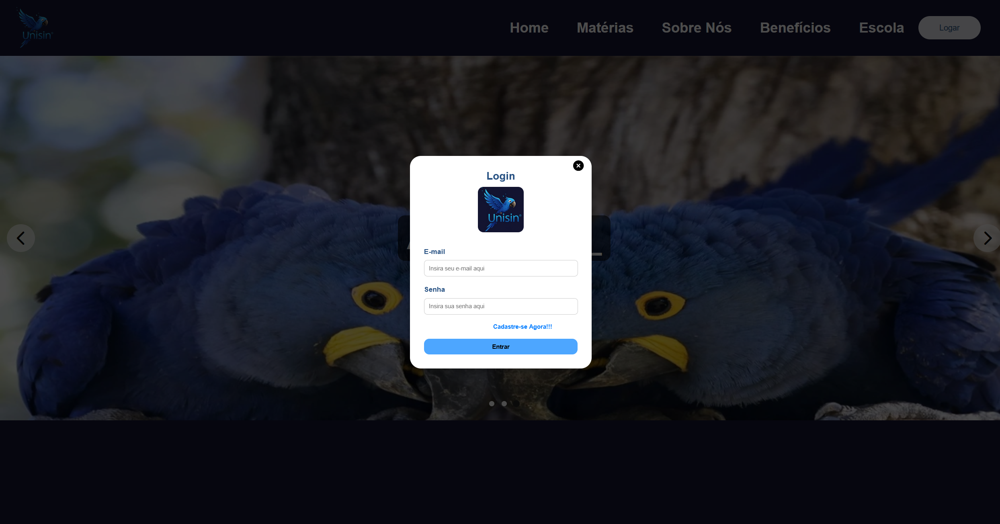
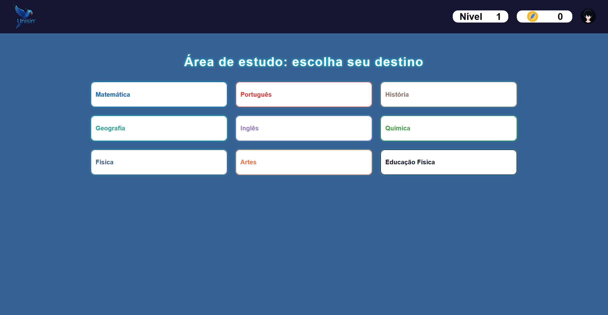
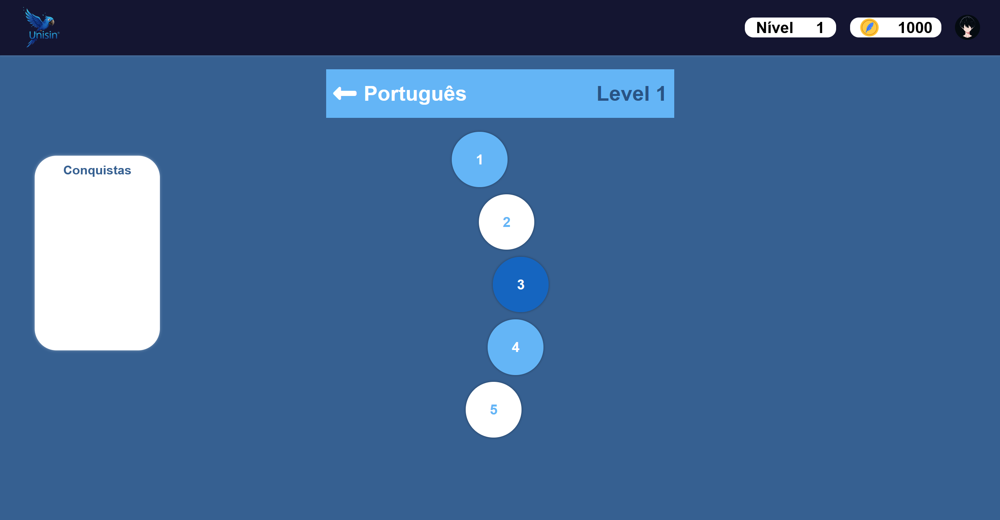
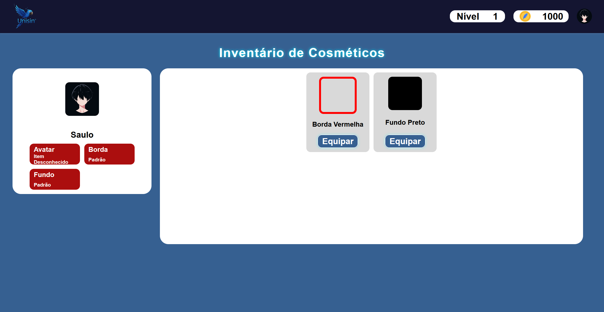
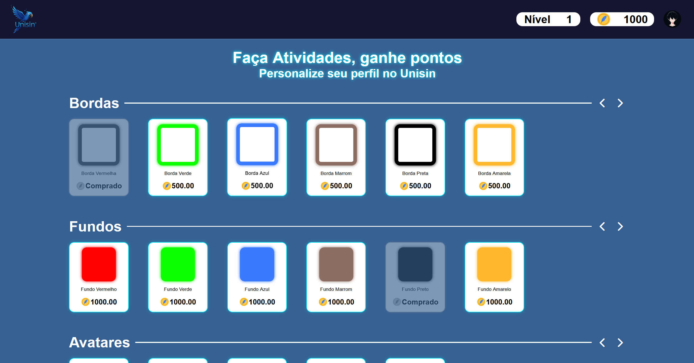

# 🎓 UniSin - Plataforma de Gamificação Educacional

## 🌟 Visão Geral do Projeto

O UniSin é uma plataforma educacional inovadora que utiliza a **gamificação** para tornar o aprendizado mais envolvente e eficaz. Desenvolvido com uma arquitetura **Full-Stack**, o projeto é dividido em um **Backend** robusto em PHP (Laravel) e um **Frontend** dinâmico em React.js.

O objetivo principal é transformar a experiência de estudo, aplicando elementos de jogos como pontos, rankings, conquistas e desafios (PvP - Player versus Player) para motivar alunos e fornecer ferramentas de gestão e acompanhamento para professores e administradores escolares.

## ðŸ› ï¸ Tecnologias Utilizadas

| Categoria | Tecnologia | Descrição |
| :--- | :--- | :--- |
| **Backend** | PHP (Laravel) | Framework robusto para a API e lógica de negócio. |
| **Frontend** | React.js | Biblioteca JavaScript para a construção da interface do usuário. |
| **Estilização** | CSS Modules | Para escopo de estilos e manutenção facilitada. |
| **Banco de Dados** | MySQL/PostgreSQL (a ser confirmado) | Armazenamento de dados de usuários, atividades, rankings e inventário. |
| **Containerização** | Docker | Para garantir um ambiente de desenvolvimento e produção consistente. |

## 🚀 Estrutura do Projeto

O repositório está organizado em duas principais pastas:

- `backend/`: Contém toda a lógica de servidor, API RESTful e conexão com o banco de dados.
- `frontend/`: Contém a aplicação web construída em React, incluindo componentes, rotas e a interface do usuário.

## ðŸ–¼ï¸ Prints de Tela (Screenshots)

Aqui você pode visualizar a interface da plataforma em ação.

| Tela | Descrição |
| :--- | :--- |
| **Login** | Tela de acesso para alunos, professores e administradores. |
| **Dashboard do Aluno** | Visão geral do progresso, ranking e moedas. |
| **Trilha de Aprendizagem** | Visualização das atividades e módulos gamificados. |
| **Inventário e Loja** | Itens e customizações disponíveis para o aluno. |
| **Perfil** | Dados de progresso e conquistas. |

<!-- ESPAÇO PARA PRINTS DE TELA -->
<p align="center">
  
  
</p>
<p align="center">
  
</p>

<p align="center">
  
  
</p>
<p align="center">
  
</p>

## âš™ï¸ Como Configurar e Executar o Projeto

Para rodar o projeto localmente, siga os passos abaixo:

1. **Pré-requisitos:** Certifique-se de ter o Docker e o Docker Compose instalados.
2. **Clonar o Repositório:**
   ```bash
   git clone https://github.com/saulobbarbosa/unisin-repo.git
   cd unisin-repo
   ```
3. **Configuração do Backend (Laravel):**
   - Crie o arquivo de variáveis de ambiente: `cp backend/.env.example backend/.env`
   - Configure as variáveis de banco de dados e outras chaves necessárias no arquivo `.env`.
4. **Executar com Docker Compose:**
   ```bash
   docker-compose up -d --build
   ```
5. **Instalação de Dependências e Migrações (Backend):**
   - Acesse o container do backend: `docker exec -it unisin-repo_backend_1 bash` (o nome do container pode variar)
   - Instale as dependências: `composer install`
   - Execute as migrações do banco de dados: `php artisan migrate --seed`
6. **Instalação de Dependências (Frontend):**
   - Acesse a pasta do frontend: `cd frontend`
   - Instale as dependências: `npm install` ou `yarn install`
7. **Acessar a Aplicação:**
   - O Frontend estará disponível em `http://localhost:3000` (ou a porta configurada no Dockerfile/React).
   - A API do Backend estará disponível em `http://localhost:8000/api` (ou a porta configurada).

## 🤠Contribuição

Sinta-se à vontade para contribuir com o projeto. Por favor, siga as diretrizes de contribuição (a ser criado) e o Código de Conduta (a ser criado).

## 📠Licença

Este projeto está licenciado sob a Licença MIT. Veja o arquivo `LICENSE` para mais detalhes.

## 📞 Contato

Desenvolvido por [Seu Nome/Equipe] - [Seu Email/Link para Perfil].
